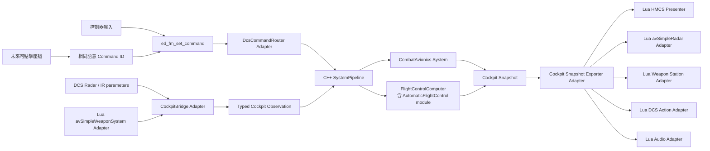

# Cockpit Lua → C++ EFM 重構計畫

狀態：草案，供架構審查
範圍：`Cockpit/Scripts/` 全目錄，以及完成遷移所需的 C++、輸入設定與測試
原則：第一輪只改架構，保留目前可觀察功能；功能修正與新功能另案處理
## 1. 結論摘要

本次重構採用以下總方向：

1. C++ 是飛機系統狀態的唯一權威。
2. Lua 只擁有 DCS 座艙輸入、DCS 專用觀測、DCS 專用操作與呈現。
3. 控制器命令直接進入 EFM；未來的可點擊座艙也必須轉成同一組語意命令。
4. `avSimpleRadar` 與 `avSimpleWeaponSystem` 必須保留，但其 Lua 只作為 Adapter。
5. AIM-9 聲音的決策移入 C++；真正的 DCS 座艙聲音播放保留在 Lua。
6. HMCS 圖面完整保留；資料來源改為 C++，Lua 只做顯示格式與 DCS 畫面操作。
7. `gear_system.lua`、`actuators*.lua`、`autopilot_system.lua`、
   `radar_state_system.lua` 最終刪除。
8. `cms_system.lua`、`weapon_system.lua`、`hmcs_system.lua`、
   `aam_audio_system.lua` 不原樣保留，而是縮成明確命名的 Adapter。
### 資料夾處置總表

| 目錄 | 處置 | 最終責任 |
|---|---|---|
| `Cockpit/Scripts/` 根目錄 | 完整保留其 DCS 啟動與定義角色 | device、command、材質、argument、panel 註冊 |
| `ControlsIndicator/` | 完整保留 | DCS 控制指示器呈現 |
| `generated/` | 完整保留 | C++／Lua 共用 ID 的生成結果 |
| `HMCS/` | 部分遷移 | 圖面留 Lua，狀態與資料來源移 C++ |
| `RADAR/` | 部分遷移 | `avSimpleRadar` Adapter 留 Lua，雷達狀態移 C++ |
| `Systems/` | 大部分遷移 | 最終只容納必要的 DCS Adapter |

「完整保留」指保留該檔案或目錄的 DCS 角色，不代表內容永遠不能整理。
## 2. 本次硬性規定
### 2.1 C++ 必須擁有

- 飛機系統的持久狀態。
- 模式切換與狀態機。
- Master Arm、Fire Control Mode、AAM submode。
- Autopilot、Auto Throttle、bypass、目標值與控制器積分器。
- Radar power request 與雷達語意狀態。
- Stores 的語意狀態與 AIM-9 數量解讀。
- AIM-9 active、contact、lock、seeker state、tone request。
- Trigger、pickle、lock、CMS program 的判斷與計時。
- 所有以 `dt` 推進的計時、累積與狀態轉移。
- 給 HMCS、聲音和 DCS Adapter 使用的完整 Snapshot。
### 2.2 Lua 必須擁有

- `device_init.lua`、indicator init/page、材質與 DCS device 註冊。
- `avSimpleRadar` 的建立及 `set_power()` 呼叫。
- `avSimpleWeaponSystem` 的 station 查詢、station 選擇及 rearm event。
- `dispatch_action()`，因為這是目前 DCS 座艙 Lua 的操作介面。
- `create_sound_host()`、sound object 的建立、播放、停止與維持。
- HMCS 2D／VR 元素、controller、文字與線條的呈現。
- DCS draw argument 或座艙 argument 的呈現判斷。
- Adapter 為了操作 DCS 資源所需的「已套用值」快取。
### 2.3 Lua 禁止擁有

- Master Arm、Fire Control、Radar、Weapon、Stores、Autopilot 的權威狀態。
- 為了補足缺少資料而自行模擬飛機系統狀態。
- 根據 HMCS 顯示參數反推武器或雷達狀態。
- 與 C++ 重複的 PID、計時器、武器 gate 或模式狀態機。
- 多個 Lua device 寫入同一個飛機狀態參數。
### 2.4 允許的 Lua Adapter 快取

下列資料不是飛機系統狀態，可以留在 Lua：

- `sound_host`、sound object。
- `applied_tone`。
- `applied_radar_power`。
- `applied_station_index`。
- 已處理的 action counter／revision。
- DCS element、material、parameter handle。

刪除 Lua Adapter 後，這些資料的複雜度不會散落到 C++ 飛機系統，
因此它們屬於 Adapter implementation，不屬於 domain state。
## 3. 目前架構與主要問題
### 3.1 現有載入鏈
```text
device_init.lua
├─ avLuaDevice           -> gear_system.lua
├─ avLuaDevice           -> actuators_system.lua
├─ avLuaDevice           -> cms_system.lua
├─ avSimpleWeaponSystem  -> weapon_system.lua
├─ avSimpleRadar         -> RADAR/FCK1C_Radar.lua
├─ avLuaDevice           -> radar_state_system.lua
├─ avLuaDevice           -> hmcs_system.lua
├─ avLuaDevice           -> aam_audio_system.lua
├─ avLuaDevice           -> autopilot_system.lua
├─ ccControlsIndicatorBase -> ControlsIndicator/
├─ ccControlsIndicatorBase -> HMCS/HMCS_init.lua
└─ ccIndicator             -> HMCS/HMCS_VR_init.lua
```
### 3.2 目前的架構問題

1. `cms_system.lua` 同時擁有 Fire Control、Weapon、Stores、
   Countermeasures、DCS action dispatch 和 debug。
2. `radar_state_system.lua` 名稱是 Radar，實際主要是 AIM-9 狀態合成。
3. `hmcs_system.lua` 不只呈現，還重複保存 Master Arm、weapon class、
   gun quantity 和 command state。
4. `autopilot_system.lua` 在 Lua 執行完整 AFCS，再用 parameters 把控制命令送回 C++。
5. `AIM9_MISSILE_COUNT`、`AIM9_TONE_STATE`、`HMCS_MASTER_MODE` 等參數有多個 writer。
6. `weapon_system.lua` 從 `HMCS_FC_MODE` 取得 Fire Control 狀態，依賴方向相反。
7. 多數 domain timer 使用固定 `update_rate`，沒有使用 EFM 真實 `dt`。
8. 大量 `pcall + default 0` 把「資料不存在」與「合法值為零」混為一談。
9. Lua 與 C++ 都在處理控制面 draw argument，形成重複責任。
10. `autopilot_system.lua` 與 `cms_system.lua` 已超過單檔 700 行，
    且多個函式超過 50 行。
## 4. 目標架構

### 4.1 C++ System 配置
#### `FlightControlComputer`

保留現有 concrete System，加入私有的 `AutomaticFlightControl` module。

原因：

- Autopilot 必須在同一個 Control frame 內影響 FBW demand。
- 另建同群組 concrete System 會受到目前 Pipeline
  「同群組看不到本幀未提交結果」的限制。
- `FlightControlComputer` 已經負責把 autopilot demand 混入 pilot input。

`AutomaticFlightControl` 只透過小型 interface 工作：
```cpp
AutomaticFlightControlState step(
    const AutomaticFlightControlInput& input,
    double dt_s);
```
它的 implementation 內部可以拆成 vertical、lateral、auto-throttle，
但不把內部 seam 暴露給其他 System。
#### `CombatAvionics`

新增一個 Equipment group concrete System，內部包含：

- Fire Control module。
- Radar state module。
- Stores／AIM-9 module。
- Countermeasure module。
- Semantic DCS action intent module。

採用一個 concrete System 的原因：

- 這些狀態在同一個 command 後必須以確定順序更新。
- 避免同 Equipment group 的一幀延遲。
- 避免多個 concrete System 互相呼叫。
- 對外只發布一份 immutable `CombatAvionicsData`，形成較深的 Module。

建議 Snapshot：
```cpp
struct CombatAvionicsData {
    FireControlState fire_control;
    RadarState radar;
    StoresState stores;
    Aim9State aim9;
    CountermeasureState countermeasures;
    ExternalActionIntent external_actions;
};
```
### 4.2 DCS Adapter 配置

最終 Lua device 只保留：

| Adapter | 必要 DCS 能力 |
|---|---|
| Radar Adapter | `avSimpleRadar`、`set_power()` |
| Weapon Station Adapter | `avSimpleWeaponSystem`、station API、rearm event |
| DCS Action Adapter | `dispatch_action()` |
| HMCS Presenter | DCS parameters、draw arguments、indicator 呈現 |
| Audio Adapter | DCS sound host 和 sound objects |
## 5. Interface 與資料交換規範
### 5.1 Command

Command 是玩家意圖，不是狀態同步。
```text
Controller / Clickable
    -> DCS command ID
    -> DcsCommandRouter
    -> Core::CommandId
    -> 唯一 System handler
```
規則：

- 每個語意 Command 只有一個 C++ owner。
- Hold command 必須傳入 press 與 release。
- Momentary command 只在 press edge 執行。
- 不用 Lua parameter 模擬 command pulse。
- `SoundTestCycle` 是呈現診斷，可繼續直接送給 Audio Adapter。
- `CMSPress`、`APLatNavTrack` 等目前未完成命令仍需被明確處理，
  不得悄悄產生新功能。

目前 route 為 `cockpit` 的 domain commands，遷移後改為 `efm`：

- Trigger、Master Arm、DGFT、MSL override、Uncage、Weapon Release、TMS。
- CMS Forward／Aft／Left／Right／Press。
- 全部 Autopilot 與 Auto Throttle commands。
- Engine Thrust Cut Test commands。

Input profile 同步移除這些命令的 `cockpit_device_id`，
使控制器輸入直接進入 EFM。

未來若 DCS 可點擊裝置不能把同一 command 直接送入 EFM，
才新增一個明確的 Clickable Input Adapter；目前沒有 clickable cockpit，
本次不預先建立 command mailbox。
### 5.2 Observation

Observation 是 DCS 提供的外部事實，不是 C++ 以外的第二份飛機狀態。

至少需要：
```cpp
struct CockpitObservation {
    RadarObservation radar;
    IrSeekerObservation ir_seeker;
    WeaponStationObservation weapon_stations;
};
```
每組 observation 必須有：

- `available`。
- `revision` 或 freshness。
- 明確單位。
- 明確無效原因。

不得再用以下方式判斷 availability：

- 所有數值相加是否不為零。
- `tonumber(...) or 0`。
- 讀取失敗後假裝取得合法零值。

第一輪為了還原功能，可以把 legacy 判斷保留為明確規則，
例如 `Aim9TrackingSource::LegacyFallback`，但必須可診斷，不能隱藏。
### 5.3 Snapshot

C++ 每個 EFM step 產生一份完整 immutable Snapshot：

- `AutomaticFlightControlState`。
- `CombatAvionicsData`。
- HMCS 所需 flight／weapon／mode 資料。
- AIM-9 requested tone。
- Radar requested power。
- External action intents。

Lua 不回寫 Snapshot 中的 domain 欄位。
### 5.4 高速值、差異更新與一次性動作

不建立一套複雜的通用 diff framework。

- Radar range、azimuth、elevation 等連續數值：每個 EFM frame 更新。
- Enum、bool、顯示模式、tone：Exporter 或 Lua Adapter 比較變化後才套用。
- Held action：使用 desired state，例如 `gun_fire_requested`。
- 一次性 action：使用單調遞增 counter，例如 `flare_release_count`。
- Lua 保存最後套用的 counter；counter 差值代表應執行的次數。
- Domain System 不知道 parameter 是否有變化，也不保存 Lua applied state。

這可避免 Lua polling 間隔不穩時遺失 pulse。
### 5.5 時間與單位

- C++ domain timer 一律使用 `FrameInput.dt_s`。
- Lua 的 `update_rate` 只決定 Adapter polling 頻率。
- CMS program 遇到較大 `dt` 時，必須消化已經經過的 interval，
  不能因為一幀較慢而漏掉步驟。
- C++ 內部一律使用 SI：秒、米、米每秒、弧度。
- DCS 參數的輸入單位在 CockpitBridge 轉換。
- knots、feet、degrees 只在輸出到顯示時轉換。
- 每一個 DCS raw parameter 都要附上已核對的來源單位與方向。
### 5.6 錯誤處理

- Cockpit parameter 缺失、非數值或 API 不可用時，記錄明確 error event。
- capability 恢復時記錄 recovery event。
- Lua 呼叫外部 DCS station API 失敗時，輸出 unavailable observation。
- 不回傳假的成功、不吞錯、不用 default count 偽裝真實 stores。
- 為功能還原而保留的 legacy fallback 必須有明確 enum 與診斷訊息。
## 6. 逐資料夾與逐檔案計畫
## 6.1 `Cockpit/Scripts/` 根目錄
### `device_init.lua` — 完整保留角色

保留：

- attributes、layout。
- creators 與 indicators 註冊。
- DCS device 類型的選擇。

整理：

- 移除 Gear、Actuators、RadarState、Autopilot 的 creators。
- CMS creator 改載入 DCS Action Adapter。
- Weapon、HMCS、Audio creator 改載入重新命名後的 Adapter。
- `avSimpleRadar` 與 `avSimpleWeaponSystem` 類型不可改成 `avLuaDevice`。
- 移除 device ID 的臨時 nil fallback；ID 必須由 `devices.lua` 唯一提供。
### `devices.lua` — 完整保留角色

目前使用 counter，刪除 device 後會造成後續 ID 全部改變。

遷移前先改成顯式穩定 ID：
```text
1 Gear             reserved after removal
2 Actuators        reserved after removal
3 DCS_ACTIONS      reuse current CMS slot
4 WEAPON_ADAPTER   reuse current WEAPON_SYSTEM slot
5 HMCS_PRESENTER   reuse current HMCS slot
6 AAM_AUDIO        unchanged
7 RADAR            unchanged
8 RADAR_STATE      reserved after removal
9 AUTOPILOT        reserved after removal
```
不重新壓縮 ID，避免輸入設定與 DCS device routing 發生非必要變化。
### `command_defs.lua` — 完整保留

- 繼續由 `tools/generate_dcs_ids.ps1` 生成。
- 不手改 command ID。
- domain command route 改為 `efm`。
- DCS-native outbound action IDs 繼續生成給 Lua Action Adapter 使用。
### `argument.lua` — 完整保留

- 作為 Lua／cockpit draw argument 名稱表。
- C++ `DcsIds/DrawArgs.h` 與本檔必須核對相同模型 argument。
- 後續可把兩者改由同一份 source data 生成，但不列為第一輪必要條件。
- `actuators_system.lua` 使用但未定義的 `angle_of_draw_left_rudder`
  不再補 fallback；該 Lua actuator 將被移除。
### `materials.lua` — 完整保留

- 保留 DCS material、texture、font 定義。
- 只允許呈現相關常數，不加入飛機系統狀態。
### `mainpanel_init.lua` — 完整保留

- 保留目前 2D cockpit shell 設定。
- 本次不加入 3D clickable cockpit。
## 6.2 `ControlsIndicator/` — 完整保留
### `ControlsIndicator.lua`

- 保留 indicator 初始化與 page routing。
### `ControlsIndicator_page.lua`

- 保留 DCS 原生 stick、rudder、throttle、brake controllers。
- `FM_MAXPOWER_SWITCH` 顯示改讀 C++ 輸出的 diagnostics Snapshot。
- 不把 Controls Indicator 變成飛機系統資料來源。
## 6.3 `generated/` — 完整保留
### `CockpitParams.g.lua`

- 繼續由單一 source data 生成 C++ 與 Lua 名稱。
- 加入 HMCS、AIM-9、Radar request、station observation、
  action intent 所需名稱。
- 禁止在新 Lua／C++ 程式中散落 raw `get_param_handle("...")` 字串。
- DCS 自己建立的 raw parameters 例外，但必須集中在 CockpitBridge catalog。
## 6.4 `HMCS/` — 部分遷移
### 完整保留的呈現檔

- `HMCS_init.lua`
- `HMCS_page.lua`
- `HMCS_VR_definitions.lua`
- `HMCS_VR_init.lua`
- `HMCS_VR_base_page.lua`
- `HMCS_VR_page.lua`

這些檔案只建立 DCS element、clip mask、文字、線條與 parameter controller，
符合 Lua 的呈現責任。
### `Systems/hmcs_system.lua` — 部分遷移

移入 C++：

- Master Arm、FC mode、dogfight mode。
- weapon class 與 weapon quantity 的語意選擇。
- gun quantity 與 AIM-9 quantity。
- trigger state。
- IAS、altitude、heading 的權威資料來源。
- 所有 command listener 與 `SetCommand()` domain 邏輯。
- fallback gun ammunition simulation。

保留於 Lua Presenter：

- 讀取 HMCS 安裝 argument 509。
- 讀取 2D／VR display mode argument 510。
- 寫入 `HMCS_ENABLED` 與 `HMCS_DISPLAY_MODE`。
- heading tape 的 slot、tick、label 排版。
- SI 到 knots／feet／degrees 的最終顯示格式，可選擇由 Exporter 統一完成。

目標檔名：`Systems/hmcs_presenter.lua`。
## 6.5 `RADAR/` — 部分遷移
### `FCK1C_Radar.lua` — 保留為 Adapter

必須保留：
```text
device_init.lua -> avSimpleRadar -> FCK1C_Radar.lua
```
保留內容：

- `perfomance` DCS radar 定義。
- `GetSelf()`、activity 與 DCS device lifecycle。
- `radar:set_power(...)`。

移入 C++：

- Radar power state。
- Radar operating state。
- Fire Control 導致的 radar power request。
- 後續所有 radar mode 與 sensor 邏輯。

目標 `update()`：
```text
讀取 C++ radar.power_requested
若與 applied_radar_power 不同
    呼叫 radar:set_power()
    更新 applied_radar_power
```
目前「每幀強制開啟」先作為 C++ 初始規則保留，功能修正另案處理。
## 6.6 `Systems/` — 大部分遷移
### `gear_system.lua` — 完整遷移後刪除

目前沒有有效邏輯，nose wheel steering 已由 EFM draw args 輸出。

驗證 C++ draw args 後：

- 移除 creator。
- 刪除檔案。
- 保留 device ID 1 為 reserved。
### `actuators.lua`、`actuators_system.lua` — 完整遷移後刪除

目前只重複輸出 rudder draw arguments，而且引用未定義的左 rudder名稱。
C++ 已經輸出 primary／secondary rudder draw args。

驗證：

- 左右 rudder 方向。
- 最大值。
- 中立值。
- Lua device 移除前後的模型動畫一致。

通過後移除 creator 與兩個檔案，device ID 2 保留為 reserved。
### `autopilot_system.lua` — 完整遷移後刪除

移入 `FlightControlComputer/AutomaticFlightControl`：

- engage gates。
- Pitch Hold、VS Hold、ALT Hold。
- Heading Hold、Heading Select。
- Auto Throttle。
- bypass enter／exit 與 reference recapture。
- PID／PI integrator。
- target adjustment。
- auto disengage。
- Mach guard。
- 所有 `dt` 計算。

輸出：

- AP master／vertical mode／lateral mode。
- A/T engaged。
- pitch／roll／throttle demand。
- target altitude／heading／speed／pitch／VS。
- bypass state 與拒絕／解除原因。

特別處理：

- NAV Track 目前只設定 mode，沒有控制 implementation；第一輪保持相同行為。
- `check_override()` 目前是空 implementation；第一輪不補新功能。
- Engine Thrust Cut Test 不屬於 Autopilot，改成 C++ diagnostics command，
  由 propulsion test intent 使用。
- 移除 Lua -> parameter -> CockpitBridge -> C++ 的 AutopilotCommand 繞路。
### `cms_system.lua` — domain 完整遷移，留下 Action Adapter

此檔拆成四部分：
#### 移入 C++ Fire Control

- Master Arm OFF／SIM／ON。
- NAV／DGFT／MSL。
- Helmet／VS／HUD／BVR submode。
- TMS mapping。
- target designation。
- dogfight auto-lock timer。
#### 移入 C++ Weapon／Stores

- gun fire gate。
- AIM-9 release gate。
- trigger、pickle、uncage 的 press／release state。
- minimum hold timing。
- AIM-9 count reconcile 與 launch後狀態。
#### 移入 C++ Countermeasures

- Forward：10 steps、1.0 s、每步 flare 1 + chaff 1。
- Left：2 steps、0.12 s、每步 flare 1 + chaff 1。
- Aft：7 steps、0.5 s、每步 chaff 1。
- Right：abort。
- pair release hold 0.04 s。
- pair release gap 0.12 s。
- arm／connection gate。
#### 保留於 Lua DCS Action Adapter

- `dispatch_action()`。
- semantic mode request 到 DCS native command 的映射。
- gun／pickle／lock 的 desired-state 套用。
- flare／chaff／paired release counter 的套用。
- `applied_*` 與已處理 counter。

目標檔名：`Systems/dcs_action_adapter.lua`。

Lua Adapter 不再決定是否允許發射，也不再保存 CMS program timer。
### `weapon_system.lua` — 部分遷移

必須保留 `avSimpleWeaponSystem`，因為目前 station 查詢、station 選擇與
rearm event 只能從這個 DCS device context 使用。

Lua Adapter 保留：

- `get_station_info()`。
- `select_station()`。
- `WeaponRearmComplete`。
- `UnlimitedWeaponStationRestore`。
- 把 station observation 發布給 C++。
- 套用 C++ 的 requested station。

C++ 擁有：

- 哪些 station 被解讀為 AIM-9。
- AIM-9 總數的 Stores Snapshot。
- 應選擇哪個 station。
- 何時要求重新選擇。
- AAM mode 與 weapon selection policy。

第一輪 station observation 至少提供：

- revision。
- scan available／error。
- 第一個 AIM-9 station index。
- AIM-9 total count。
- rearm revision。

目前的 wsType 與 CLSID fallback 識別規則先完整還原，
但標記來源為 `WsType` 或 `ClsidLegacyFallback`。

目標檔名：`Systems/weapon_station_adapter.lua`。
### `radar_state_system.lua` — 完整遷移後刪除

移入 CockpitBridge：

- DCS radar／STT／TDC／contact raw parameter 讀取。
- DCS IR seeker／lock raw parameter 讀取。
- availability、數值驗證與單位轉換。

移入 CombatAvionics：

- weapon active。
- DCS IR > radar telemetry > legacy fallback 的來源優先順序。
- contact／lock。
- seeker state。
- requested tone。
- seeker azimuth／elevation。
- lock range。

不建立一個照抄原檔的 C++ `RadarStateSystem`。
### `aam_audio_system.lua` — 部分遷移

C++ 擁有：

- `Aim9Tone::Off`。
- `Aim9Tone::Seek`。
- `Aim9Tone::Acquire`。
- `Aim9Tone::Lock`。
- 決定當前 requested tone。

Lua 保留：

- sound host 建立與 fallback host。
- sound object 建立。
- play／stop／sustain。
- gain 套用。
- `applied_tone`。
- `SoundTestCycle` 與 test playlist。

移除：

- 初始化時寫回 `AIM9_TONE_STATE`。
- 初始化時寫回 `AIM9_WEAPON_ACTIVE`。

目標檔名：`Systems/aam_audio_adapter.lua`。
## 7. 功能還原測試

| 測試面 | 必須還原的案例 |
|---|---|
| Autopilot | 240 knots、WOW、roll／pitch engage gate；Master 預設 PH+HH；Pitch／VS／ALT capture；Heading Hold／Select wrap；bypass freeze 與 recapture；Mach guard；NAV Track placeholder；不規則 `dt` |
| Fire Control／Weapon | Master OFF／SIM／ON；NAV／DGFT／MSL；DGFT 強制 Master ON；Uncage hold；trigger／pickle minimum hold；release gate；TMS 四向；lock begin／finish／switch；launch 後 inventory reconcile |
| Radar／AIM-9 | inactive gate；COOL／RDY Seek；IR signal Acquire；IR lock Lock；來源優先順序；兩個 legacy fallback；四種 seeker state；初始 radar power |
| Countermeasures | 三個 program 的 step／interval／數量；Right abort；Master OFF／SIM abort；pair ON／hold／OFF／gap；大 `dt`；較慢 Lua polling |
| Weapon Station | 掃描 station 0–6；wsType 與 CLSID 識別；無 AIM-9；多 station count；空 station 重選；rearm revision；API error unavailable |
| HMCS | 2D／VR gating；IAS／altitude／heading 單位；heading tape wrap；mode／submode；weapon class／quantity；gun firing；AIM-9 顯示；arguments 509／510 |
| Audio | Off／Seek／Acquire／Lock；同 tone 不重啟；sustain；host fallback；test playlist；不得改寫 weapon state |
| Draw arguments | gear、NWS、elevator、flaperon、rudder、airbrake、slat、afterburner、nozzle、wheel spin；Lua Actuator 移除前後比對 |
## 8. 遷移順序與建議 commits

每個 phase 結束都必須是可建置、可測試、單一 writer 的狀態。

| Phase | 可獨立提交的工作 |
|---|---|
| 0 凍結行為 | 完整 baseline 見 [`docs/cockpit-baseline/README.md`](cockpit-baseline/README.md)：來源行為與實機結果分層；固定 mission／loadout／步驟／log；生成 parameter writer／reader、command、device 與 source 清冊 |
| 1 ID／Interface | 固定 device ID；擴充 CommandId／Router；生成 parameter catalog；typed Observation；Snapshot Exporter；單一 writer 檢查 |
| 2 被動 device | 補 draw-arg tests；移除 Gear；移除 Actuators；DCS 動畫驗收 |
| 3 Autopilot | FCC 內加入 AFCS；遷移 modes/controllers/bypass/`dt`；發布 Snapshot；切換 routes/Input；移除舊 CockpitBridge loop；刪除 Lua；分離 Thrust Cut Test |
| 4 Fire Control | 新增 CombatAvionics；遷移 Master/modes/TMS/designation；建立 Action Intent 與 Lua Adapter；切換 commands；移除對應 CMS branches |
| 5 Radar／AIM-9 | typed Radar／IR observations；遷移來源優先、fallback、contact、lock、seeker、tone；Radar Adapter 改讀 Snapshot；刪除 RadarState Lua |
| 6 Stores | Weapon Lua 縮成 observation Adapter；加入 revisions；C++ station/count/selection；套用 requested station；移除 HMCS 反向依賴；重新命名 |
| 7 Gun／Pickle | 遷移 release gate 與 minimum hold；Lua 套用 desired state；遷移 one-shot counters；切換 routes/Input |
| 8 Countermeasures | 遷移 programs/timers/counts；Lua 套用 release counters；驗證 `dt`/polling；清空 CMS domain 邏輯；重新命名 |
| 9 HMCS | 補齊 C++ display Snapshot；Lua 只讀；移除 command/ammo simulation；保留 tape/argument gating；重新命名 |
| 10 Audio | 改讀 requested tone；移除 weapon writes；保留 resource lifecycle/test playlist；重新命名 |
| 11 清理 | 移除 legacy params 與舊 FrameInput bridge；檢查 Lua 責任；替換舊 tests；更新 README；跑完整自動與 DCS 驗收 |
## 9. 自動化架構檢查

建議新增 `tools/check_cockpit_architecture.ps1`，檢查：

- 只有 Audio Adapter 可呼叫 `create_sound_host`。
- 只有 Radar Adapter 可呼叫 `set_power`。
- 只有 Weapon Station Adapter 可呼叫 station API。
- 只有 DCS Action Adapter 可呼叫 `dispatch_action`。
- Lua 不得保存 AP、Fire Control、Radar、Weapon、CMS domain timer。
- 每個輸出 parameter 只有一個 writer。
- 新 parameter 名稱必須來自 generated catalog 或 raw DCS whitelist。
- 刪除的 device ID 不得被重新分配。
- `device_init.lua` 只註冊實際需要的 DCS device。
## 10. 明確不在本次處理

- 不新增儀表。
- 不新增完整 radar mode。
- 不新增 HMCS targeting。
- 不完成 NAV Track。
- 不重新調校 Autopilot gains。
- 不修正 AIM-9 legacy fallback 的真實性。
- 不改 Countermeasure program 內容。
- 不新增 3D clickable cockpit。
- 不改聲音素材與音量平衡。
- 不改 radar performance 數值。

這些項目可以在架構遷移、功能還原完成後獨立討論。
## 11. 已知風險與處理

| 風險 | 處理 |
|---|---|
| DCS Lua 與 EFM 更新順序不同 | Snapshot + persistent desired state + action counter |
| parameter 的合法零值被當成 unavailable | 明確 availability，不用非零 heuristic |
| 刪除 device 造成 ID 改變 | 先固定顯式 ID，保留 reserved slots |
| station API 只能在 Lua 使用 | 保留 `avSimpleWeaponSystem` Adapter |
| radar API 只能在 Lua device 使用 | 保留 `avSimpleRadar` Adapter |
| 座艙聲音無 C++ arbitrary playback interface | C++ 決策，Lua 播放 |
| 同 Equipment group 有一幀依賴延遲 | 相關 combat modules 放進同一 concrete System |
| 遷移時形成兩個 writer | 每個 phase 先建立新 writer，切換 consumer，同一 commit 移除舊 writer |
| 舊 fallback 行為不可靠 | 第一輪明確標記並還原；後續另案修正 |
| 大 Lua 檔直接翻譯成大 C++ 檔 | 按 Module 責任拆 implementation，對外保持小 Interface |
## 12. 完成條件

全部滿足才算完成：

- [ ] C++ 是 AP、Fire Control、Radar、Weapon、Stores、CMS 的唯一權威。
- [ ] Lua 不再從 HMCS parameter 反推 domain state。
- [ ] `radar_state_system.lua` 已刪除。
- [ ] `autopilot_system.lua` 已刪除。
- [ ] `gear_system.lua` 與 `actuators*.lua` 已刪除。
- [ ] `cms_system.lua` 已縮成 DCS Action Adapter。
- [ ] `weapon_system.lua` 已縮成 Weapon Station Adapter。
- [ ] `hmcs_system.lua` 已縮成 HMCS Presenter。
- [ ] `aam_audio_system.lua` 已縮成 Audio Adapter。
- [ ] 所有 domain commands 直接進入 EFM。
- [ ] 每個 cockpit output parameter 只有一個 writer。
- [ ] 所有 domain timer 使用真實 `dt`。
- [ ] 所有 observation 有 availability 與明確單位。
- [ ] native tests、architecture check、generator check、DLL build 全部通過。
- [ ] DCS 手動功能還原 matrix 全部通過。
## 13. 審查時最需要確認的五個決定

1. 是否接受以一個 `CombatAvionics` concrete System
   包住 Fire Control、Radar、Stores/AIM-9、Countermeasures 私有 modules。
2. 是否接受保留五個必要 Lua Adapter：
   Radar、Weapon Station、DCS Action、HMCS Presenter、Audio。
3. 是否接受第一輪完整保留 legacy fallback，但改成可見、可診斷的規則。
4. 是否接受 device ID 固定並保留刪除後的 reserved slots。
5. 是否接受 continuous action 用 desired state、一次性 action 用 counter，
   而不是用容易遺失的 Lua pulse parameter。
