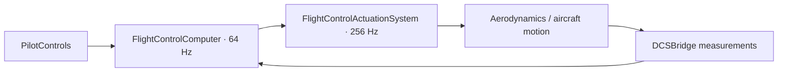

# F-CK-1C 縱向飛控邏輯重新設計

## 1. 文件目的與狀態

- 狀態：**已實作並通過自動驗證，等待 DCS 針對性驗證**。
- 修訂日期：2026-08-05。
- 適用範圍：`FlightControlComputer` 內的縱向命令、控制律、迎角／過載保護、狀態管理、診斷與驗證。
- 不重做：外部 System 排程、64 Hz FLCC、256 Hz `FlightControlActuationSystem`、DCSBridge 單位翻譯、橫向／方向軸控制律。
- 本文件取代 `FLIGHT_CONTROL_ARCHITECTURE_REFACTOR_PLAN.md` 中舊有的「Nz 轉 q 串級控制」與「同時產生 Nz、q feed-forward」設計。

## 2. 先說結論

目前的問題不是單一增益失調，而是縱向控制拓樸錯誤：正常收輪模式同時建立 Nz 命令與駕駛 q feed-forward，再以 Nz 外迴路產生 q 目標，最後交給 q PI。迎角控制又同時縮減 Nz 與 q feed-forward。這個組合不是公開 F-16 資料描述的正常縱向鏈，並且讓濾波器、兩層積分器與致動器飽和保存互相不相容的歷史狀態。

重新設計後保留一個深的 `FlightControlLaws` Module，並在其內建立一個有單一狀態 owner 的 `LongitudinalControlLaw`。正常收輪模式採公開 YF-16 資料描述的結構：

```text
駕駛桿力或 AFCS 來源
  -> 單一 Nz 命令
  -> alpha/Nz command limiter
  -> Nz feedback + forward-loop integration
  + washed-out q feedback
  + alpha static-stability feedback
  -> pitch effort
  -> surface mixer
  -> actuator command
```

q 在這條鏈中是阻尼回授，不是與 Nz 並行的駕駛命令。放輪模式則是獨立的 pitch-rate command law；兩種命令不在同一 tick 內同時有效。

## 3. 為什麼舊鏈必須廢棄

### 3.1 舊鏈的四個根本錯誤

1. **一個操作產生兩個縱向目標**：後拉桿同時產生 Nz 與正 q feed-forward，控制器無法明確回答「現在追蹤的是過載還是俯仰角速度」。
2. **建立未受來源支持的串級控制**：Nz PI 先生成 q 目標，再由 q PI 生成控制面需求。公開 YF-16 資料描述的是 Nz forward-loop integration、washed-out q feedback 與 alpha feedback 的合成，不是這個兩層 PI 串級。
3. **迎角功能混合不同責任**：同一物件同時限制 Nz、縮減 q feed-forward，卻沒有獨立實作 alpha static-stability feedback。這把「命令限制」與「穩定性回授」混成一件事。
4. **測試 seam 選錯**：冷啟控制器的單步測試不包含積分歷史、控制面速率與飛機運動，因此抓不到持續後拉時的蓄積、飽和、突然卸載與重新放權。

### 3.2 為什麼會出現一陣一陣的煞車

目前持續後拉時的實際邏輯是：

```text
後拉桿維持不變
  -> Nz 與正 q feed-forward 同時持續存在
  -> Nz/q 兩層狀態逐步累積，stabilator 到達上限
  -> alpha schedule 開始縮減新的 Nz 與 q feed-forward
  -> 舊的濾波與積分狀態仍要求抬頭
  -> 誤差反向後，積分狀態在較晚時間集中釋放
  -> stabilator 突然由大抬頭量退回，體感像煞車
  -> alpha 暫時下降後 schedule 又放回權限
  -> 同一循環再次發生
```

這是秒級閉迴路鬆弛振盪，不是 64 Hz 更新率不足。提高更新率只會更密集地計算同一個錯誤拓樸。

## 4. 證據基線與使用規則

### 4.1 主要公開資料

1. [NASA YF-16 高迎角飛行試驗報告（1976）](https://ntrs.nasa.gov/api/citations/19760017178/downloads/19760017178.pdf)
   - 駕駛透過力感側桿命令 normal acceleration。
   - washed-out pitch rate 與 filtered normal acceleration 是回授。
   - forward-loop integration 使穩態 normal acceleration 跟隨命令。
   - alpha feedback 提供人工靜穩定性。
   - 獨立 alpha limiter 透過修改駕駛 Nz 命令限制迎角。
2. [NASA F-16XL high-angle-of-attack flight control laws（1997）](https://ntrs.nasa.gov/api/citations/19970005147/downloads/19970005147.pdf)
   - 收輪正常模式在低迎角以 g-command 為主，高迎角才進入 Nz/alpha blending。
   - 放輪模式以 pitch-rate command 為主，並在較高迎角加入 alpha blending。
   - 報告提供參考門檻與正常迎角限制，但不足以直接還原 F-CK-1C 增益。
3. [NASA F-16XL Block 40 Digital Flight Control System（2004）](https://ntrs.nasa.gov/api/citations/20040040334/downloads/20040040334.pdf)
   - 支持數位 FLCC 與 64 Hz 執行背景。
   - 支持數位飛控內部同時具有 normal-acceleration、pitch-rate 等控制律功能，但未公開足以複製的完整方程與增益。

### 4.2 證據標籤

所有設定、演算法註解與測試規格必須使用下列標籤：

| 標籤 | 意義 |
|---|---|
| `Confirmed F-CK-1C` | 有 F-CK-1C 一手資料直接支持 |
| `Reference-derived` | 公開 F-16／F-16XL 資料支持拓樸或行為 |
| `Project-defined` | 為配合本專案氣動模型而設計或調校 |
| `Developer-only` | 非擬真開發功能，production default 不可啟用 |

禁止把不同報告中的兩段斜率、起始角度與終止角度拼成一條看似「F-16」的曲線。公開資料能決定拓樸時採拓樸；不能證明 F-CK-1C 數值時，數值必須標為 `Project-defined` 並由本機體 plant 調校。

## 5. 保留的外部架構

外部裝置邊界沒有問題，不需要因這次失敗推倒：



- `PilotControls`：整合不同 DCS commands，輸出物理化的駕駛輸入。
- `FlightControlComputer`：選擇命令來源、執行飛控／AFCS 邏輯、輸出電子控制面需求。
- `FlightControlActuationSystem`：模擬致動器位置、速率、延遲與飽和。
- `DCSBridge`：只翻譯 DCS 世界與 Core 物理／航空單位，不擁有控制 policy。

錯誤集中在 `FlightControlComputer` 內部的縱向 Interface 與 Implementation。

## 6. 新的命令契約：每次只能有一個縱向目標

### 6.1 Tagged command

Command System 對控制律輸出一個 tagged command；型別本身禁止同時存在 Nz 與 q 目標：

```cpp
using LongitudinalCommand = std::variant<
    NormalAccelerationCommand,
    PitchRateCommand>;
```

概念資料如下：

```cpp
struct NormalAccelerationCommand final {
    double target_g;
};

struct PitchRateCommand final {
    double target_rad_s;
};
```

- 收輪正常模式：`NormalAccelerationCommand`。
- 放輪／進場模式：`PitchRateCommand`。
- AFCS ATT／ALT guidance 必須先依目前 law mode 解析成其中一種命令，再進入控制律。
- 禁止以 `1 g + q feed-forward` 表示一個 AP 俯仰目標。
- source selection 完成後，manual 與 AFCS 都走同一條 protection、feedback、surface 與 actuator path。

目前實作以起落架手柄而非 AP 模式選擇 law。收輪時，ATT 先形成期望 pitch rate，再依 `Nz = cos(γ) + Vq/g` 轉為 Nz；ALT 的垂直速度誤差先形成垂直加速度，再依同一 point-mass 關係轉為 Nz。放輪時，ATT 直接形成 q command；ALT 則以 `q = a_vertical / V` 形成 q command。`FlightStateComputation` 由垂直速度與空速推導 γ；使用 IAS 作為 V 是目前可用 air-data contract 下的 `Project-defined` 近似，不宣稱為已證實的 F-CK-1C 內部演算法。

### 6.2 命令選擇順序

```text
manual command ─┐
                ├─ source/authority selection
AFCS guidance ──┘
       -> one LongitudinalCommand
       -> active longitudinal law
       -> protection
       -> feedback synthesis
       -> surface mixer
```

AFCS 負責模式、capture target 與 guidance；它不保存控制面積分器，也不能繞過 G/AOA protection。

## 7. `FlightControlLaws` 深 Module

### 7.1 Public Interface

對 FLCC 其他區域只公開既有的高層 seam：

```text
FlightControlLaws::update(ControlLawInput) -> FlightControlLawsResult
```

這個 Interface 隱藏以下 Implementation：

```text
FlightControlLaws
  ├─ LongitudinalControlLaw        stateful private seam
  │    ├─ command protection       pure helper
  │    ├─ Nz feedback conditioning pure helper/state update
  │    ├─ q washout                private state update
  │    ├─ alpha stability feedback pure helper
  │    └─ state tracking/antiwindup
  ├─ LateralControlLaw
  ├─ DirectionalControlLaw
  ├─ LateralDirectionalCoordination
  └─ SurfaceCommandMixer
```

`AngleOfAttackControl` 不再作為一個獨立 public 或平行 Module。它目前混合的責任應分別回到縱向控制律內的 command protection 與 alpha stability feedback。每條公式不需要各自建立 class；只有擁有重要狀態或能隱藏足夠複雜度的 seam 才成為物件。

### 7.2 單一狀態 owner

`LongitudinalControlLaw` 單獨擁有：

- filtered normal acceleration state；
- q washout filter state；
- forward-loop integral state；
- mode transition／tracking state；
- 與實際飽和輸出相連的 anti-windup state。

應移除正常 Nz 模式中的 `filtered_pitch_reference` 與第二個 q target integrator。只有獨立 pitch-rate command mode 可以持有該模式所需的 q command conditioning state。

## 8. 收輪正常模式邏輯

### 8.1 完整鏈

```mermaid
flowchart TD
    S["Stick force / resolved AFCS source"] --> N["Pilot or automatic Nz command"]
    N --> L["Alpha/Nz command limiter"]
    AOA["Measured alpha"] --> L
    L --> E["Protected Nz command"]
    NZ["Filtered measured Nz"] --> E
    E --> I["Forward-loop integration"]
    Q["Measured pitch rate q"] --> W["Washout filter"]
    AOA --> AS["Alpha static-stability feedback"]
    I --> SUM["Feedback synthesis"]
    W --> SUM
    AS --> SUM
    SUM --> U["Unsaturated pitch effort"]
    U --> SAT["Electronic limit / surface mixer"]
    SAT --> ACT["Actuator command"]
    SAT -. "tracking feedback" .-> I
```



### 8.2 各訊號責任

- **Nz command**：表達駕駛或 AFCS 想要的機動過載。
- **alpha/Nz command limiter**：迎角升高時收緊可用正 Nz 命令；不直接命令固定負 q，也不直接夾住控制面。
- **filtered Nz feedback**：形成 normal-acceleration tracking error。
- **forward-loop integration**：消除穩態 Nz 誤差；不得在輸出飽和時繼續累積不可能實現的命令。
- **washed-out q feedback**：提供短期俯仰阻尼；washout 移除穩態分量，所以 q 不會變成另一個永久目標。
- **alpha static-stability feedback**：隨 alpha 提供人工靜穩定性；這與 command limiter 是兩條不同路徑。
- **surface mixer**：把 pitch effort 轉成具名、具 radians 單位的 stabilator demand。

### 8.3 Anti-windup

Anti-windup 必須同時知道：

1. protection 後的 Nz command；
2. 未飽和 pitch effort；
3. 電子限制後的 command；
4. `FlightControlActuationSystem` 回傳的實際位置／飽和狀態。

當迎角限制收緊時，integrator tracking／back-calculation 到保護後的電子控制目標；電子輸出受限時 tracking 到電子可達命令；只有確認實體行程止擋時才 tracking 到實際控制面位置。一般致動器速率延遲屬於 plant dynamics，不視為失去控制權，也不以實際位置持續拉回積分器。禁止先保存舊抬頭積分量，再在數秒後集中釋放。

## 9. 放輪／進場模式

- 主要命令為 pitch rate，輸入是 `PitchRateCommand`。
- measured q 形成該模式的主要追蹤回授。
- 高迎角時可加入 alpha blending/protection；公開 F-16XL 資料支持這個行為，但 F-CK-1C 的門檻、增益與 blend 公式目前均為 `Project-defined`。
- 此模式不得沿用正常 Nz 模式的積分狀態。
- 收／放輪切換必須 bumpless：新模式的第一個輸出由前一個實際 actuator demand 初始化，而不是把兩個控制器輸出瞬間相加或清零。

## 10. 高迎角保護邊界

### 10.1 正常保護包含什麼

1. alpha/Nz command limiting；
2. alpha static-stability feedback；
3. saturation-aware integrator tracking；
4. 控制權不足的明確診斷。

### 10.2 正常保護不包含什麼

- 不在鏈尾強制固定 nose-down q。
- 不修改原始駕駛桿輸入；保護作用在飛控命令與回授合成內。
- 不讓 AP 繞過保護。
- 不把 MPO、deep-stall recovery 或 departure recovery 偷塞進正常 law。

YF-16 報告中的「alpha 超過約 30°後給完整低頭命令」是針對當時迎角感測器在 30° 飽和所加的獨立備援。沒有 F-CK-1C 感測器與 MPO 證據前，本專案不實作這條 emergency backup；它不能被誤稱為一般 F-16 迎角限制器。

### 10.3 低動壓現實

任何控制律都不能在控制面已無足夠氣動權限時保證迎角。YF-16 試驗也記錄低動壓機動可能 overpower limiter。系統必須區分：

- `ProtectionActive`：限制器正在收緊命令且仍有控制權；
- `ActuatorSaturated`：致動器達位置／速率上限；
- `ControlAuthorityLimited`：已有正確低頭需求，但飛機仍因低動壓無法降低迎角。

這些是診斷狀態，不是偷偷改變 law 的 fallback。
目前 `ControlAuthorityLimited` 只在 AOA protection 已要求低頭、縱向電子命令或對稱水平尾翼的實體行程權限已耗盡，而且 alpha 未以最低恢復速率下降達 0.5 秒後成立。副翼或方向舵飽和不會觸發此縱向診斷。0.5 秒 persistence 與 0.5 deg/s 最低恢復速率均為 `Project-defined` 診斷門檻，不會回寫或改變控制律。

## 11. 單位規範

| 訊號 | Core／FLCC 單位 |
|---|---|
| AOA、姿態、控制面位置 | radians |
| p、q、r | radians/second |
| normal acceleration command/measurement | g |
| dynamic pressure | pascals |
| indicated/calibrated airspeed | meters/second，僅顯示層轉 knots |
| altitude guidance | feet，與既有 HUD／AFCS contract 一致 |
| magnetic heading guidance | degrees，採 wrap-aware domain type |

控制計算中不得因顯示方便混入 degrees；DCSBridge 負責 DCS 世界／座標的轉換。名稱必須帶出物理量或使用具名 domain type，禁止只有 `value`、`pitch`、`rate` 這類無法辨識單位的欄位。

## 12. 診斷設計

為了在 DCS 中直接看到邏輯鏈，`DebugTelemetryHub` 暫時註冊下列訊號：

- raw/resolved Nz command；
- protected Nz command；
- alpha command-limit decrement；
- filtered measured Nz；
- q washout feedback contribution；
- alpha static-stability contribution；
- forward-loop integral contribution；
- unsaturated pitch effort；
- electronic-limited pitch effort；
- demanded/actual stabilator radians；
- protection、actuator saturation、control-authority states。

這些是開發診斷投影，不得成為控制律的反向依賴。問題收斂後可停止註冊特定 watch；通用 debug.csv／Debug Indicator 工具本身保留。

## 13. 驗證策略

### 13.1 靜態／Module tests

- tagged command 永遠只有一個 active objective。
- Nz mode 不存在 pilot q feed-forward。
- alpha/Nz limiter 對 alpha 單調、連續，並保留推桿降低迎角的權限。
- alpha command limiting 與 alpha stability feedback 是可個別驗證的兩條路徑。
- 所有跨 seam 單位、正負號與範圍明確。

### 13.2 動態控制律 tests

- 持續後拉後收緊 alpha limit，不保留與新限制不相容的 integral。
- protection 進出時 pitch effort 連續；變化率只由明示電子／致動器限制決定。
- Nz mode 與 q mode 切換時第一個輸出跟隨切換前的實際 actuator demand。
- 輸出飽和後解除輸入，不得出現延遲數秒才集中卸載的行為。

### 13.3 閉迴路 regression seam

這次錯誤依賴完整時間歷史，正式 regression 必須至少包含：

```text
FlightControlComputer
  -> FlightControlActuationSystem
  -> deterministic longitudinal aircraft plant
  -> measured Nz/q/alpha feedback
  -> FlightControlComputer
```

只測 `AngleOfAttackControl::update()` 或冷啟 `ControlLaws::update()` 不足以宣稱問題已修復。

### 13.4 DCS 針對性測試

1. **有足夠動壓的持續後拉筋斗**：固定進場高度、IAS、構型與滿後拉時間；檢查 alpha overshoot、控制面連續性與是否形成重複週期。
2. **限制進出**：逐步後拉、維持、稍微放鬆、再後拉；檢查 protection active 進出是否平順。
3. **低動壓垂直機動**：刻意進入控制權不足區，確認診斷為 `ControlAuthorityLimited`，不可把物理限制誤判成控制器振盪。
4. **放輪 q-command**：小幅階躍、持續與釋放，確認沒有帶入 Nz-mode integral。
5. **AFCS 共路徑**：ATT／ALT 各自接通，確認自動命令經過相同 protection 與 actuator path。

驗收不使用「看起來有動」作標準。每次必須保存 `debug.csv`、`fck1c_state.csv`、`fck1c_efm.log`、`dcs.log`，並記錄起始 IAS、高度、構型、輸入與時間點。

## 14. 實作切割順序

截至 2026-08-05，Step 0 至 Step 5 已完成：命令契約、正常 Nz law、command protection、anti-windup、放輪 q mode、bumpless transition、診斷與 deterministic closed-loop tests 均已落地；Release 測試共 3027 checks、0 failures。Step 6 的 DCS 飛行驗證仍待執行。

### Step 0 — 固定失敗證據

- 把本次持續後拉的關鍵時間段與三次突然卸載轉成可重現 regression 規格。
- 不直接把大型 DCS CSV 當單元測試資料；抽取能重現狀態蓄積與飽和的最小 deterministic fixture。

### Step 1 — 先修命令 Interface

- 建立 tagged `LongitudinalCommand`。
- manual 與 AFCS 只輸出一個有效縱向 objective。
- 刪除正常模式的 pilot q feed-forward 與 `1 g + q feed-forward` AP 轉接。
- 先以測試證明雙命令不能再進入控制律。

### Step 2 — 重建正常 Nz law

- 實作 filtered Nz、forward-loop integration、q washout、alpha static-stability feedback。
- 移除 Nz-to-q target 串級與正常模式 q target integral。
- 保持 `FlightControlLaws` public Interface 不變，變動內縮在 longitudinal private seam。

### Step 3 — 整合 command protection 與 anti-windup

- 將 `AngleOfAttackControl` 拆回 Nz command limiter 與 alpha feedback responsibility。
- 以 protected command 與實際飽和輸出更新唯一 integral owner。
- 增加 protection／saturation／authority diagnostics。

### Step 4 — 重建 q mode 與 bumpless transition

- 放輪模式獨立使用 `PitchRateCommand`。
- 實作 mode state initialization/tracking，不並行混合兩個 controller outputs。
- 迎角 blend 的拓樸標 `Reference-derived`，數值標 `Project-defined`。

### Step 5 — 建立閉迴路 harness 並調校

- 先用 deterministic plant 排除 limit cycle、integrator windup 與切換跳變。
- 再依 F-CK-1C EFM plant 調校 gains/schedules；不得直接複製 F-16 數值。
- 橫向／方向軸只跑 regression，不在這一步重寫。

### Step 6 — DCS 驗證與 code review

- Build、執行 `install.bat`、依第 13.4 節測試。
- DCS 驗證未通過前，不宣稱 longitudinal refactor 完成。
- 驗證通過後才做 Standards／Spec 雙軸 code review 與 commit。

## 15. 尚未決定但不阻礙架構的事項

1. F-CK-1C 的 alpha onset、limit、Nz decrement slopes 與 gain schedules 沒有可確認的一手公開值；須以 `Project-defined` 數值調校，不能冒充 F-16 原值。
2. 是否未來實作類似 YF-16 的 >30° emergency nose-down backup，必須等 F-CK-1C 感測器、MPO 或 departure-recovery 證據；目前設計明確不包含。
3. 閉迴路 harness 已採既有 `FlightControlComputer -> FlightControlActuationSystem -> deterministic aircraft response` 測試 seam，並保留控制器、致動器與 aircraft response 三段時間歷史；未來只有在這個 plant 無法重現 DCS 問題時才提高物理複雜度。

以上三點不影響現在決定命令契約、正常 Nz 拓樸、狀態 owner 與保護邊界。
