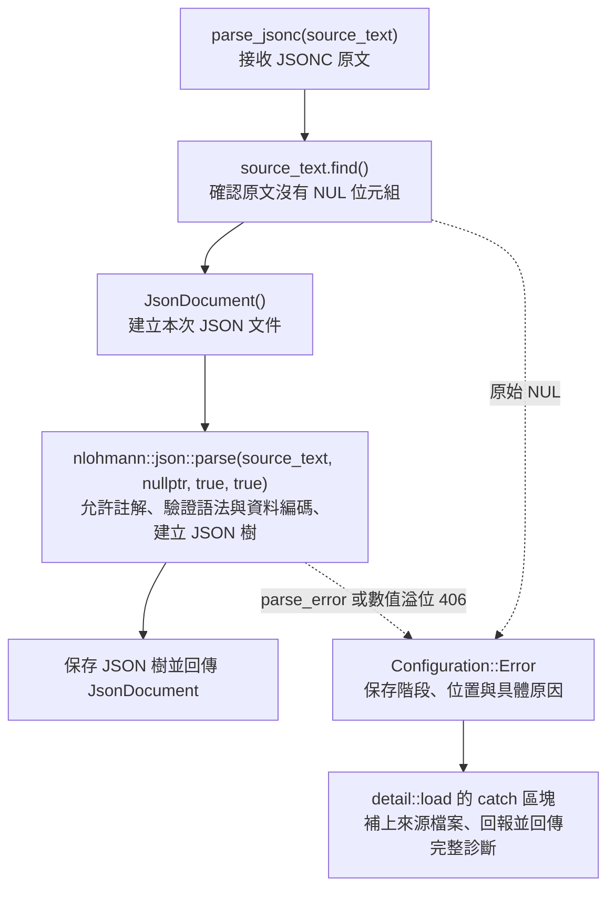

# 設定檔載入器

對外入口為 `Configuration::load<T>(relative_path)`，回傳 `LoadResult<T>`。
成功結果包含完整且通過驗證的設定，失敗結果包含完整 `Diagnostic`。
設定儲存、載入時機及失敗後是否繼續，由呼叫端決定。

`Configuration.h` 的範本建立目標結構，提供該型別的 `read_configuration` 回呼。
`Configuration.cpp` 的 `detail::load` 依序直接使用 `resolve_file`、`read_file`、
`parse_jsonc`，再同步呼叫轉換函式。
`detail` 表示內部實作慣例，一般呼叫端使用 `load<T>`。

`initialize` 設定共用的 FM 根目錄及診斷出口，`shutdown` 清除兩者。
載入器不儲存設定或快取文件；原文於解析完成後釋放，JSON 由暫存 `JsonDocument` 擁有，
`Value` 提供該次文件的唯讀欄位檢視。

文件使用 JSONC；資料字串及欄位名稱的 UTF-8 由 JSON 解析器驗證，註解不另做編碼驗證。
檔案路徑禁止使用絕對路徑；以 FM 為起點解析後，實際文件必須位於 FM 內。
`..` 與副檔名不另外限制，單份文件上限為 16 MiB。
`read_file` 直接開啟檔案，從同一串流取得大小、一次配置緩衝並讀入原文。
開啟、定位及讀取失敗由串流例外集中處理，診斷保留失敗的操作名稱；
超過大小上限或出現原定長度以外的內容時回報讀取錯誤。
所有宣告欄位必填；多餘或缺少欄位均拋出 Error，立即中止本次載入。
工具及欄位驗證只提供階段、欄位位置與原因；來源檔案由 `detail::load` 統一補上。
路徑解析失敗時使用請求位置，成功後使用解析得到的實際檔案位置。
`JsonDocument` 只保存 JSON 樹。

`parse_jsonc` 先拒絕原始 NUL（0x00），再呼叫一次 `nlohmann::json::parse`。
解析器直接處理註解、JSON 語法與資料字串的 UTF-8，成功後保存 JSON 樹並回傳 `JsonDocument`。
解析呼叫不提供 callback；重複名稱由 nlohmann 處理，每個名稱只保留一個值，不額外發出診斷。
JSON 跳脫序列 `\u0000` 可正常解析，不屬於原文中的 NUL 位元組。

資料字串的編碼錯誤與 JSONC 語法錯誤使用解析器原生訊息，其中包含行列與原因。
原始 NUL 錯誤提供從 1 起算的原文位元組位置。
數值解析溢位提供檔名與解析器原生原因，不提供完整欄位路徑。
後續欄位轉換與驗證錯誤以檔名與完整欄位路徑定位。
`Diagnostic.line` 與 `column` 為 0；解析器行列保留於 `reason`，不另外計算。

`escape_json_pointer_token()` 處理欄位名稱中的 `/` 與 `~`，維持 JSON Pointer 的含義。

設定錯誤在工具與欄位驗證中使用 `Configuration::Error` 中止本次處理，
統一以 `Error(stage, reason, field)` 建立；`field` 可省略，`what()` 提供原因。
由 `detail::load` 捕捉，補上來源、回報並轉成失敗結果。
日誌訊息統一使用 `Diagnostic::message()`；失敗結果保存同一份完整診斷。
程式缺陷、資源失敗及診斷出口拋出的其他例外維持原樣傳遞。
因此 `load<T>` 不具備 `noexcept` 保證。
