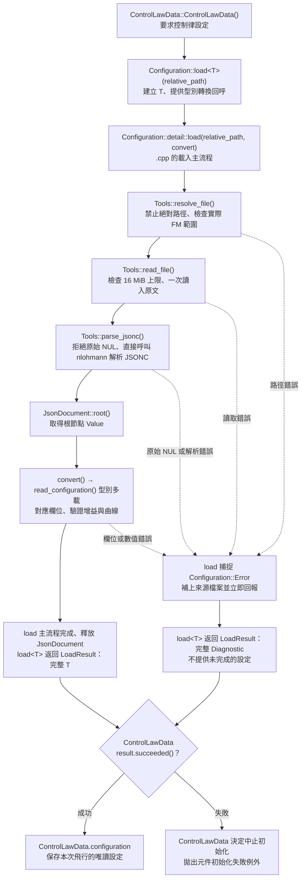
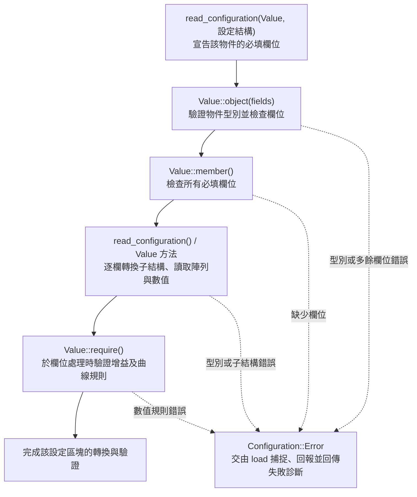

# FlightControlComputer 架構

`FlightControlComputer` 代表一台飛控電腦，直接持有七個元件與五個獨立資料庫。
FLCC 負責組裝及 Pipeline 輸入輸出邊界；`Executive` 集中維護排程表並呼叫任務。

目前提供可設定增益與曲線的三軸直接映射。
**尚未實作回授控制、配平、模式、監控、故障、啟動與 AMUX 運算。**
兩種對外狀態快照仍維持 `status.available == false`。
本階段不處理備援。

## 檔案結構

```text
FlightControlComputer/
├─ Entry.cpp
├─ FlightControlComputer.h
├─ FlightControlComputer.cpp
├─ README.md
├─ Components/
│  ├─ Executive/
│  │  ├─ Executive.h / Executive.cpp
│  │  └─ TaskFrequency.h / TaskFrequency.cpp
│  ├─ SystemMonitor/
│  ├─ SelectorMonitor/
│  ├─ FailureManager/
│  ├─ StartupAndRestart/
│  ├─ AmuxProcessor/
│  └─ ControlLaws/
└─ Database/
   ├─ ExecutiveTables.h / ExecutiveTables.cpp
   ├─ ControlLawData.h / ControlLawData.cpp
   ├─ ControlLawData/
   │  ├─ Configuration.h / Configuration.cpp
   │  └─ State.h
   ├─ InputOutputData.h
   ├─ SystemStatusTables.h
   └─ AmuxData.h
```

其餘六個元件各有同名的 `.h` 與 `.cpp`。`Entry.cpp` 只登記一個
`flight_control_computer` System；七個內部元件不繼承 `System`，也不加入外層系統目錄。

## 組裝與固定任務表

1. FLCC 先建立五個資料庫，再建立七個元件。
2. 六個受排程元件透過建構子綁定固定的資料庫參照。
3. FLCC 將 ExecutiveTables 與六個元件的參照交給 Executive。
4. Executive 在建構時一次建立完整任務表，驗證名稱與入口，保持填表列順序。
5. 外層呼叫 `FLCC::step`，由 FLCC 直接呼叫 `Executive::step`。

頻率、順序及入口統一維護於 [Executive.cpp](Components/Executive/Executive.cpp)
的建構子。元件只提供 `step`，不宣告排程設定；FLCC 不收集或註冊任務。
Executive 不將自己登記為任務。

六個元件的入口統一為：

```cpp
void step(std::chrono::nanoseconds scheduled_time, double dt_s);
```

兩個參數分別是本次預定模擬時間與此任務的固定週期，直接按值傳入。
`std::chrono::nanoseconds` 保存整數奈秒，表示從本架飛機建立時的零時刻起算的預定模擬時間。

每列填入名稱、精確 Hz、元件實例與成員函式指標，例如：

```cpp
{"control_laws.step", TaskFrequency(64), control_laws, &ControlLaws::step}
```

`&ControlLaws::step` 類似尚未綁定實例的方法參考。TaskDefinition 的建構子將它
綁定至指定實例，以 `std::function` 保存不同型別元件的入口；填表處不需撰寫 lambda。
同一元件可以出現在多列，分別綁定不同入口及 Hz，不需共同的虛擬元件基底類別。

目前六列都是 **64 Hz 骨架任務**，並非已確認的實機元件頻率或完整資料依賴：

| 列順序 | 元件 | 尚未實作 |
|---:|---|---|
| 1 | StartupAndRestart | 啟動與重新啟動程序 |
| 2 | AmuxProcessor | AMUX 傳輸及資料處理 |
| 3 | SystemMonitor | 系統與輸入監控 |
| 4 | SelectorMonitor | 資料選擇與有效性判斷 |
| 5 | FailureManager | 故障處理及降級策略 |
| 6 | ControlLaws | 回授、配平、模式、濾波與積分；目前只提供三軸直接映射 |

啟動元件目前也只有週期性空白入口；尚未定義真正的啟動狀態機或一次性啟動工作。

C++ 成員依宣告順序建立、反向銷毀，因此資料庫宣告在元件之前，
Executive 宣告在受排程元件之後。FLCC、ExecutiveTables 與 Executive 的複製及搬移
操作已刪除，使資料庫參照與任務綁定使用固定地址。所有元件及資料庫由 FLCC 直接持有。

## 同一列的設定與狀態

ExecutiveTables 不使用彼此平行的設定陣列與進度陣列。取得一個任務列後，
就能同時查看該任務的所有設定與執行狀態：

```text
ExecutiveTables
├─ tasks[]
│  └─ ExecutiveTask
│     ├─ const TaskDefinition definition
│     │  ├─ id
│     │  ├─ frequency
│     │  └─ 綁定的 step 入口
│     └─ TaskRuntimeState state
│        ├─ completed_ticks
│        └─ next_due
└─ ExecutiveSchedulerState
   └─ advanced_through
```

- `definition` 是真正的 const 值物件，在任務列建構時完成設定，之後不可修改。
- `completed_ticks` 是成功返回的任務呼叫次數，為進度依據。
- `next_due` 是由 `completed_ticks + 1` 與頻率推導的快取，不以週期累加。
- `advanced_through` 是最近一次成功完成的外層目標模擬時間。
- `time_until_next(reference_time)` 查詢剩餘模擬時間；負值表示相對於該查詢時間已到期。

Database 提供唯讀的任務列與整體狀態參照。這些參照指向目前資料，不複製快照。
只有 Executive 可初始化表格及更新狀態；`friend class Executive` 表示允許 Executive
存取 Database 私有成員，不代表繼承或所有權移轉。排程表沒有公開的新增、排序或重設介面。
Executive 本身不另外保存進度，函式內只保留搜尋與呼叫需要的暫時變數。

## 精確頻率與時間契約

`TaskFrequency(p, q)` 代表 `p / q Hz`，不是相對外層頻率的倍率。
兩個參數皆為正的 32 位元整數，建立時約分；例如 `TaskFrequency(64)` 是 64 Hz，
`TaskFrequency(5, 2)` 是 2.5 Hz。頻率不能超過奈秒解析度的 1 GHz。

```text
第 n 次預定時間（奈秒） = floor(n × 1,000,000,000 × q / p)
```

計算使用整數商與餘數分解，避免中間乘法溢位，不依賴 double 或 long double。
在可表示範圍內，每次向下取整的量化誤差小於一奈秒，不逐次累積。

- 第一次呼叫在一個完整週期後，零時刻不呼叫任務。
- 不同到期時間按時間先後執行；同時到期按表格列順序執行。
- 外層較慢或不規則呼叫時，按時間順序執行所有已到期任務。
- 每個任務收到自身的預定時間及浮點 `dt_s = q / p`；dt 不參與到期判斷。
- 重複傳入相同目標時間不重複執行；負時間與時間倒退會被拒絕。
- 入口成功返回後才增加該列的次數並更新下次時間；超出時間範圍會拋出例外。
- 任務例外直接向上傳遞；尚未實作故障恢復、重啟排程或資料交易回復。

Executive 的 [find_next_due](Components/Executive/Executive.cpp) 找到最早到期的列，
`step` 呼叫入口並更新同一列的狀態，直到目標時間以前沒有待執行工作。

外層 SystemPipeline 目前仍以 64 Hz 呼叫 FLCC。內部排程不依賴此頻率，
但欠期補跑只能使用 FLCC 最近取得的輸入快照；
**尚未實作歷史觀測重建或重新取樣，也未驗證實際 CPU 截止期限。**

## 五個資料庫與固定參照

五個分區是具型別、記憶體內的資料容器，FLCC 分別持有，沒有 FlightControlData 總容器。
多個元件可參照同一分區；單執行緒內的先後關係由排程決定，不使用鎖。
參照不轉移所有權；const 參照限制該使用者的修改權限。

| 元件 | 固定依賴 |
|---|---|
| Executive | ExecutiveTables：建立固定設定、讀寫執行狀態 |
| StartupAndRestart | ControlLawData、SystemStatusTables：讀寫 |
| AmuxProcessor | AmuxData：讀寫 |
| SystemMonitor | InputOutputData：唯讀；SystemStatusTables：讀寫 |
| SelectorMonitor | InputOutputData：唯讀；SystemStatusTables：讀寫 |
| FailureManager | SystemStatusTables：讀寫 |
| ControlLaws | InputOutputData、ControlLawData：讀寫；SystemStatusTables：唯讀 |

上述依賴是目前的骨架，尚未構成完整演算法資料流程。
ControlLawData 保存唯讀的直接映射設定與目前的限幅狀態；AmuxData 仍是空白骨架。
濾波器、積分器與其他運算歷史的內容尚未實作。

## Pipeline 邊界與目前行為

FLCC 讀取 FlightControlObservation、PilotControlSignal、ThrottleLeverSignal、
LandingGearData 與 FlightControlActuatorState，存入 InputOutputData。
對外發布 FlightControlActuatorCommand、EngineThrottleCommand、
AutomaticFlightControlSnapshot 與 FlightControlComputerSnapshot。

ControlLaws 將三軸操縱輸入依曲線與增益映射為 [-1, 1] 的舵面位置需求。
FlightControlActuationSystem 負責將正規化需求轉成實際舵面角度，油門需求維持建構時初值。
其餘元件尚未實作內部運算，也尚未登記 FLCC 指令處理器。
兩種狀態快照保持不可用，不以空白任務的成功呼叫表示飛控功能已完成。

## 控制律設定載入

ControlLawData 建構時自行呼叫共用 `Configuration::load<ControlLawConfiguration>()`，
載入 FM/FLCC/ControlLaws.jsonc，檢查 LoadResult 的成功狀態後，
將完整設定存入唯讀的 configuration 子區塊。控制律需要完整設定，
因此載入失敗時由 ControlLawData 中止自身初始化。
state 子區塊保存控制律最近一次完成的運算狀態。
共用入口位於 Common/Configuration/Configuration.h，load<T> 建立目標設定，
並以回呼將該型別的轉換函式交給 Configuration.cpp 的 detail::load 主流程。
load 主流程直接呼叫 resolve_file、read_file 與 parse_jsonc，
依序完成路徑檢查、讀取原文與 JSONC 解析，再執行轉換回呼。
BridgeContext 建構時透過 initialize 設定共用的 FM 根目錄與診斷回報函式，
解構時呼叫 shutdown 清除兩者。
parse_jsonc 只接收原文，拒絕原始 NUL，建立暫存 JsonDocument 後解析一次並保存 JSON 樹，
於 load 主流程返回或例外離開時釋放。
read_file 直接開啟檔案，從同一串流確認單份文件大小上限為 16 MiB，
再一次配置原文緩衝並完整讀入；I/O 失敗集中回報，內容長度變動亦屬讀取錯誤。
原文供 JSONC 解析及解析錯誤定位，於 parse_jsonc 返回時釋放。
ControlLawData/Configuration.cpp 定義 read_configuration 的各型別多載，
負責欄位對應及增益、曲線的驗證，於 load 內執行。
文件採 JSONC，資料字串與欄位名稱的 UTF-8 由解析器驗證，註解不另做編碼驗證。
路徑以 FM 為起點，禁止絕對路徑；解析後的實際文件必須位於 FM 內。
`..` 與副檔名不另外限制。
所有欄位都必填；多餘、缺漏、型別或數值規則錯誤均拋出 Error，中止本次載入。
重複名稱由 nlohmann 處理，不額外檢查或回報。
工具與欄位驗證只提供階段、欄位位置與原因；JsonDocument 不保存來源路徑。
load 主流程統一補上來源檔案；解析路徑失敗時使用請求位置，成功後使用實際位置。
load 主流程捕捉此例外，補上來源、立即送出診斷並回傳失敗；load<T> 回傳的
LoadResult 僅包含完整設定或失敗診斷，不會交出尚未完成的設定。
診斷包含實際檔名、處理階段、行列或完整欄位路徑，以及具體原因。
資料字串的編碼錯誤與語法錯誤均屬解析錯誤，保留解析器原生行列與原因；
原始 NUL 錯誤提供原文位元組位置，JSON 跳脫序列 `\u0000` 可正常解析。
欄位驗證錯誤使用完整欄位路徑。
Error 的完整診斷由 load 送入 EventLog，同時透過 LoadResult.error() 提供給呼叫端。
若 ControlLawData 中止初始化，ABI 邊界另行記錄元件初始化失敗的狀態。
ControlLaws 在 step 時使用 ControlLawData 中的設定與狀態。
詳細設定格式見 [ControlLaws 說明](Components/ControlLaws/README.md)。

### 載入主流程



### 欄位檢查流程



## 驗證

[FlightControlExecutiveTests.cpp](../../../../F-CK-1C_EFM_Tests/FlightControlExecutiveTests.cpp)
涵蓋多入口綁定、同列設定與狀態、64/32/3/2.5 Hz、不規則外層呼叫、
固定列順序、一小時非整奈秒週期、大次數整數精度、溢位、初始化及 Pipeline 骨架輸出。
執行方式見 [DLL 建置與測試指南](../../../../../../docs/BUILD_DLL.md)。

## 設計參考

七個軟體元件與五個資料分區參考
[NASA TP-2857](https://ntrs.nasa.gov/api/citations/19890014956/downloads/19890014956.pdf)
圖 26；圖 30 的分區、資料組件、區段、元素與欄位是資料組織階層。
目前以 C++ 型別表達所需分區，未複製報告的位元配置、硬體介面與備援系統。
